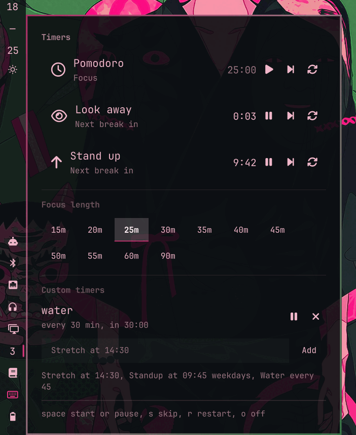

# omarchy-timers

Pomodoro, water, 20-20-20 eye rest and stand-up reminders in one Omarchy bar
widget.



They are all the same thing underneath: a rule that alternates a work phase
with a break phase. One engine runs them, so there is one place to fix a bug
and one widget in the bar instead of four.

| Rule | Default | Break | Break screen |
|---|---|---|---|
| Pomodoro | 25 min focus | 5 min, 15 min every 4th | off |
| Water | every 45 min | 30 s | off |
| Look away | every 20 min | 20 s | on |
| Stand up | every 50 min | 5 min | off |

Pomodoro is off until you start it. The three health rules start with the shell.

**None of them is mandatory.** Each row has a remove button next to its skip
and restart buttons (`x` on the keyboard) that takes the rule out of the list,
and the buttons underneath put back the ones you removed. The choice lives in
`~/.local/state/omarchy/sterre-timers.json`, so a rule you deleted stays
deleted across restarts. Remove all four and the widget is nothing but your own
timers, which is what the panel's bottom half is for.

## Install

```sh
omarchy plugin add https://github.com/sterre-g/omarchy-timers.git --enable
```

Or clone it yourself into `~/.config/omarchy/plugins/sterre.timers/` and run
`omarchy-shell shell rescanPlugins`.

Place it in the bar:

```sh
omarchy plugin enable sterre.timers --section right --after omarchy.clock
```

## Using it

The bar button shows the time left on whichever rule is due next: minutes when
more than a minute remains, seconds below that. It turns the urgent colour
while a break is running, and its tooltip lists every rule you kept.

- Left click opens the panel, right click pauses or resumes the due rule.
- In the panel: `space` start or pause, `s` skip the current phase, `r` restart
  the rule, `o` turn it off, `x` remove it from the list, `Esc` close.
- The break screen takes over the display and dismisses on any key or click,
  or when the break runs out.

### Focus length

The panel has a row of preset lengths, whole minutes, from 15 up to 90. Picking
one writes it into this widget's own entry in `~/.config/omarchy/shell.json`,
so it is still your focus length after a restart.

### Custom timers

Add your own reminders in the field at the bottom of the panel. One line each,
in either of two shapes:

```
Stretch at 14:30              a wall clock time, every day
Standup at 09:45 weekdays     the same, Monday to Friday only
Water every 45                a repeating interval, in minutes
```

They are written to `~/.local/state/omarchy/sterre-timers.json`, so they
survive a shell restart and a reboot. A wall clock reminder knows whether it
already fired today, so it does not repeat itself, and one that is more than
ten minutes late is dropped rather than replayed: a shell started at nine in
the evening should not fire this morning's reminders at you.

The running rules are saved there too, so a restart picks a countdown up where
it left off instead of starting it over.

From a script or a keybinding:

```sh
omarchy-shell sterre.timers status              # every rule you kept, one line each
omarchy-shell sterre.timers start look-away     # also restarts a running rule
omarchy-shell sterre.timers skip pomodoro
omarchy-shell sterre.timers pause stand-up
omarchy-shell sterre.timers resume stand-up
omarchy-shell sterre.timers stop stand-up
omarchy-shell sterre.timers open                # panel, on the focused monitor
omarchy-shell sterre.timers toggle
omarchy-shell sterre.timers focus 35            # focus length, whole minutes
omarchy-shell sterre.timers add "Water every 45"
omarchy-shell sterre.timers customs             # list them with their next due time
omarchy-shell sterre.timers remove 1
omarchy-shell sterre.timers drop water          # take a default rule off the list
omarchy-shell sterre.timers restore water       # and put it back
```

## Settings

Every key in [manifest.json](manifest.json) under `barWidget.schema` is editable
from the bar widget settings UI, or inline on the widget entry in
`~/.config/omarchy/shell.json`:

```json
{ "id": "sterre.timers", "lookAwayEveryMinutes": 30, "waterEveryMinutes": 60 }
```

Changing a duration applies from the next phase, not the running one.

`<rule>Enabled` only decides whether a rule starts itself with the shell. The
rule is still listed and you can start it by hand. Removing it takes it out of
the list altogether, and that choice lives in the state file, not here.

Sounds are off. Every transition raises a desktop notification either way; set
`sound` to `true` if you also want the chime.

## How it works

[Model.js](Model.js) is the whole engine and is pure: `tick(rule, runtime, now)`
returns the next runtime plus an event, and never touches the clock or the
shell itself. That is what [test/model.test.js](test/model.test.js) exercises.

[Service.qml](Service.qml) is a singleton. It owns the one second `Timer`, feeds
`Model.tick`, and turns events into a notification through
`omarchy-notification-send`, an optional `pw-play` chime, and a summon of
[Overlay.qml](Overlay.qml) for rules with the break screen turned on. It exists
because a bar widget is built once per monitor: a timer living in the widget
would fire once per screen and notify you twice.

[Panel.qml](Panel.qml) is the bar widget, one instance per monitor, and only a
view. Each instance registers itself with the service so the single IPC target
can still open the panel, which it does on the focused monitor because the bar
keeps at most one panel open shell wide.

Two things worth knowing:

- A tick advances one phase at a time. If the shell is suspended over several
  break intervals you get one notification on wake, not a queue of them.
- A countdown restored from disk is only trusted while it still points at the
  future. Anything older belonged to a session that has already ended, so the
  rule starts fresh rather than firing immediately.

There is no idle detection yet, so a rule that comes due while you are away from
the keyboard still fires.

## Development

```sh
./run-tests                                  # node, no framework
./dev-sync                                   # copy into ~/.config/omarchy/plugins/
omarchy plugin validate ~/.config/omarchy/plugins/sterre.timers
omarchy-shell shell rescanPlugins
omarchy-shell sterre.timers probe            # widget count the service can see
```

Saving a file under `~/.config/omarchy/plugins/` hot reloads it, but editing
[Service.qml](Service.qml) needs `omarchy restart shell`: the replaced instance
keeps its IPC target registered, so the new one is ignored until the process
restarts. Adding a brand new file to an installed plugin needs a restart too,
otherwise Qt serves its cached directory listing and reports a file name case
mismatch.

## License

MIT, see [LICENSE](LICENSE).
